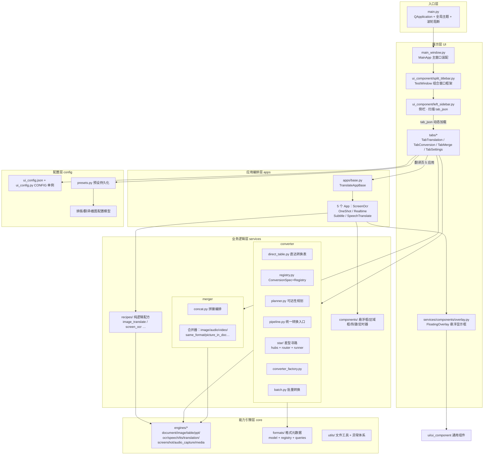
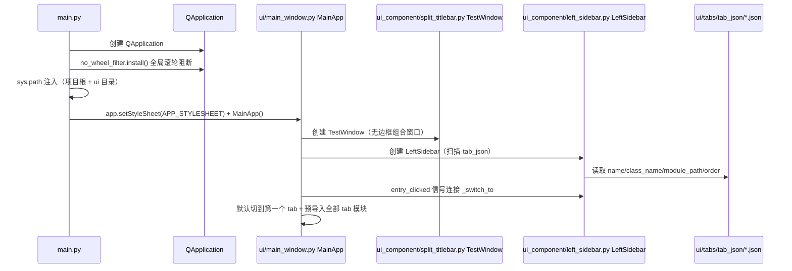
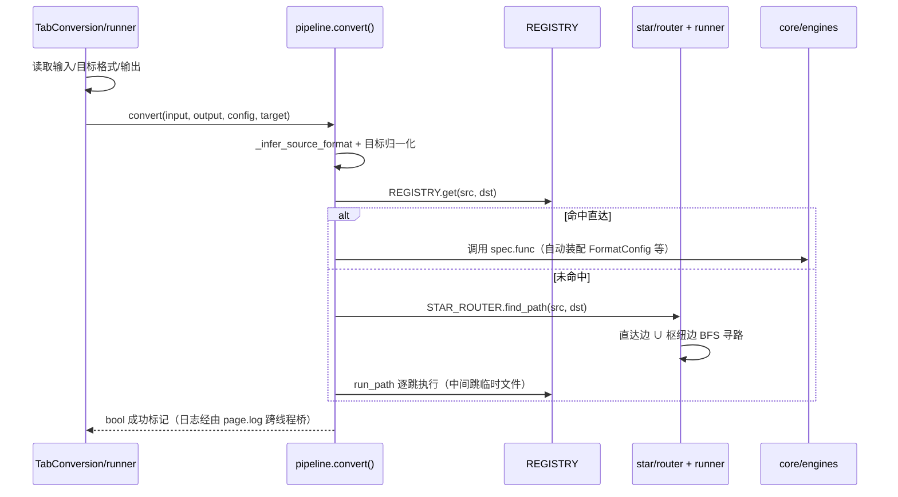
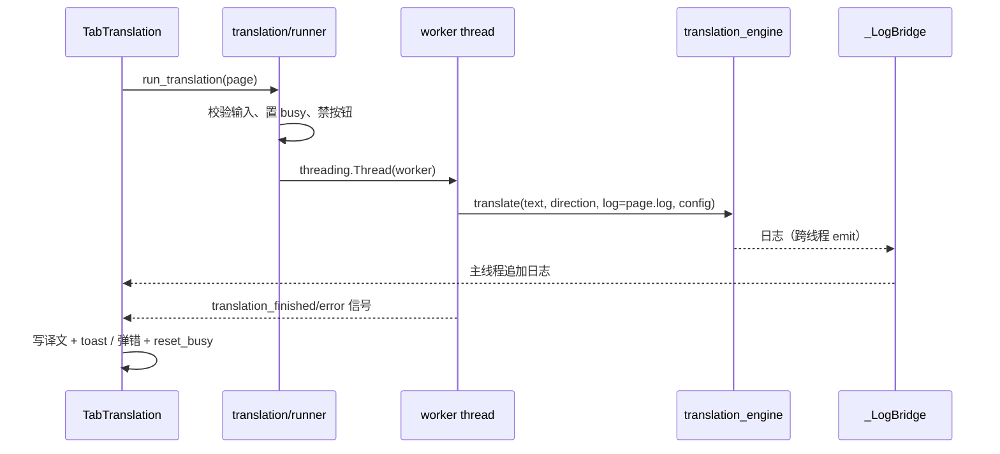
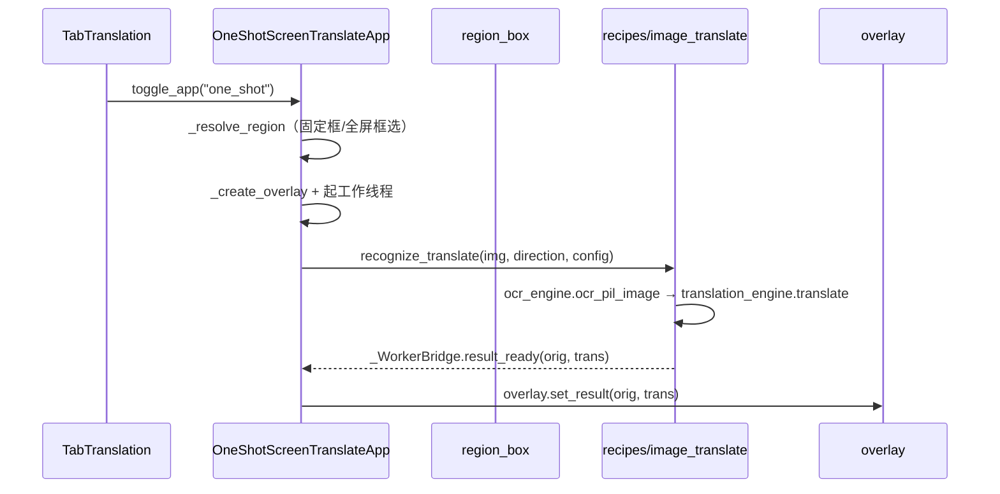
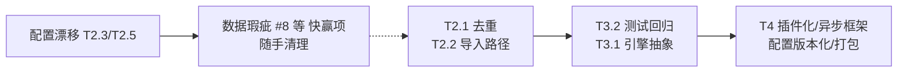

# octool 代码维基（CODE WIKI）

> 版本：v2（对齐 P0/P1 整改后的代码现状）
> 生成日期：2026-08-29
> 适用范围：d:\Project\PythonProject\octool（Python 3.12 / PySide6 / Windows）

***

## 目录

1. [项目概览](#1-项目概览)
2. [整体架构](#2-整体架构)
3. [启动流程与主窗口装配](#3-启动流程与主窗口装配)
4. [UI 层（ui/）](#4-ui-层ui)
5. [服务层（services/）](#5-服务层services)
6. [引擎层（core/）](#6-引擎层core)
7. [应用层（apps/）](#7-应用层apps)
8. [配置层（config/）](#8-配置层config)
9. [关键类与函数速查](#9-关键类与函数速查)
10. [核心数据流与调用链](#10-核心数据流与调用链)
11. [依赖关系图](#11-依赖关系图)
12. [项目运行方式](#12-项目运行方式)
13. [已知问题与风险清单](#13-已知问题与风险清单)
14. [大型整改方案](#14-大型整改方案)

***

## 1. 项目概览

### 1.1 定位与功能

octool 是一个 **PySide6 桌面工具集**，目前包含四大板块：

| 板块 | tab              | 功能                                        |
| -- | ---------------- | ----------------------------------------- |
| 转换 | `TabConversion`  | 任意格式互转：单文件转换 / 文件夹批量逐文件转换                 |
| 拼接 | `TabMerge`       | 文件夹内多文件合并为单个文件（自我拼接 / 格式转换拼接 / 图片→文档）     |
| 翻译 | `TabTranslation` | 中英互译（Hy-MT2 / Opus-MT 离线模型）+ 五个"屏幕级"悬浮窗应用 |
| 设置 | `TabSettings`    | 日志目录、应用信息等最小设置页                           |

翻译板块下有 5 个悬浮窗应用：**屏幕OCR / 屏幕翻译 / 屏幕实时翻译 / 屏幕字幕 / 语音翻译**，均复用 `apps/` 基类 + `services/` 纯逻辑 + 悬浮显示框组合而成。

### 1.2 技术栈

* **GUI**：PySide6 6.11（Qt 无边框窗口、QSS 主题、自定义分割窗/悬浮窗）

* **文档/表格/演示**：python-docx、python-pptx、openpyxl、pdfplumber、pymupdf、pypdfium2、pdfminer、img2pdf、reportlab、pypandoc、markdown、html2text、beautifulsoup4 等

* **媒体**：ffmpeg（外部可执行文件，路径经 `ui_config.json` 配置）、Pillow、opencv、numpy

* **OCR**：PaddleOCR 3.x（PP-OCRv6\_tiny，onnxruntime 后端）

* **翻译/语音**：llama\_cpp\_python（Hy-MT2-1.8B GGUF）、CTranslate2 系 Opus-MT、SenseVoice/Whisper（STT）、edge-tts 等（TTS）

* **系统**：pywin32（Windows 截图/WASAPI）、psutil

> 完整依赖见 `requirements.txt`（按用途分组、锁定精确版本）。

### 1.3 目录总览

```
octool/
├── main.py                        # 启动入口
├── requirements.txt               # 依赖清单
├── apps/                          # 最终应用（5 个悬浮窗应用 + 基类 + 信号桥）
├── core/
│   ├── engines/                   # 原子能力引擎（docx/pdf/ocr/tts/stt/翻译/媒体…）
│   ├── formats/                   # 格式元数据注册表（Format + 查询 API）
│   └── utils/                     # 通用文件工具 + 异常体系
├── config/
│   ├── ui_config.json             # 全部 UI/路径/模型路径 参数（单一真相）
│   ├── ui_config.py               # UI 配置加载器（单例 CONFIG）
│   ├── presets.py + presets/      # 预设/上次配置持久化
│   └── *.py                       # 各类排版/翻译/截图配置模型
├── services/
│   ├── converter/                 # 格式转换业务（直达表/注册表/规划/星型寻路）
│   ├── merger/                    # 文件合并业务
│   ├── recipes/                   # 拼接配方（纯逻辑：图像识别+翻译等）
│   └── components/                # 悬浮框/区域框/热键/定时器
├── resources/statics/icon/        # 图标（SVG 线稿 + logo png）
└── ui/
    ├── main_window.py             # 主窗口装配（MainApp）
    ├── theme.py                   # 全局 QSS 生成
    ├── icon_res.py                # SVG 图标着色工具
    ├── toast.py                   # 轻提示
    ├── ui_component/              # 通用 UI 组件（侧栏/标题栏/分割窗/缩放器/按钮）
    ├── tabs/                      # 选项卡（tab_translation / tab_conversion / tab_merge / tab_settings）
    │   ├── translation/           # 翻译页子包（卡片/执行/应用控制）
    │   ├── conversion/            # 转换页子包
    │   ├── merge/                 # 拼接页子包
    │   ├── tab_component/         # 通用卡片组件
    │   └── tab_json/              # tab 注册 JSON（动态加载的核心）
    ├── options/                   # 各类"参数设置"对话框
    └── widgets/                   # 格式选择器 / 滚轮过滤器
```

***

## 2. 整体架构

### 2.1 分层架构（自顶向下）



### 2.2 层间依赖规则（整改后的约定）

* **依赖方向单向**：`ui → services → core →（外部库）`，`apps` 介于 `ui` 与 `services` 之间承担"业务拼接 + UI 挂载"。

* **UI 层不得直接依赖引擎细节**：`ui/tabs/conversion` 通过 `services.converter.convert()` 统一入口转换；`ui/tabs/translation` 通过 `core.engines.translation_engine.translate()` 翻译。

* **配置单一真相**：所有 UI 参数与关键外部路径收敛到 `config/ui_config.json`，代码经 `CONFIG` 单例读取，不得出现硬编码魔法值。

* **通用组件下沉**：跨 tab 复用的卡片/按钮/标题栏/分割窗放 `ui/tabs/tab_component` 与 `ui/ui_component`，禁止各 tab 复制粘贴。

* **注册表驱动**：新增 tab = 在 `ui/tabs/tab_json/` 放一个 JSON；新增直达转换 = 在 `direct_table.CONVERSION_TABLE` 加一行；新增格式 = 在 `core/formats/registry.py` 加一条 `Format`。

***

## 3. 启动流程与主窗口装配

### 3.1 启动链路



关键点：

* `main.py` 做了两处 `sys.path` 注入：项目根（支持 `ui.*`、`config.*` 等包导入）与 `ui` 目录（支持 `main_window.py` 内 `from ui_component import ...` 的无前缀导入）。

* `MainApp` 以 `TestWindow`（`split_titlebar.py`）为窗口框架：顶部标题栏 + 底部折叠标题栏 + `QSplitter` 两栏（左栏侧栏、右栏内容区）+ `WindowResizer` 无边框缩放。

* 右侧内容区按 `class_name` 缓存 widget，切换不销毁。

### 3.2 tab 注册机制（tab\_json）

每个 tab 由 `ui/tabs/tab_json/` 下的一则 JSON 声明：

```json
{ "name": "翻译", "class_name": "TabTranslation", "module_path": "ui.tabs.tab_translation", "order": 3 }
```

* `left_sidebar._scan_tab_infos()` 扫描目录 → 按 `order`（升序）排序生成导航按钮 → 点击发射 `entry_clicked(name, class_name, module_path)`。

* `main_window._get_or_create_widget()` 用 `importlib.import_module(module_path)` + `getattr(module, class_name)` 实例化；`module_path` 缺失时回退 `tabs.<蛇形类名>` 推导（`camel_to_snake`）。

* 设置页同样走此机制（`tab_settings.py`）。

***

## 4. UI 层（ui/）

### 4.1 主窗口与入口

| 文件                              | 职责                                                                                                                                             |
| ------------------------------- | ---------------------------------------------------------------------------------------------------------------------------------------------- |
| `ui/main_window.py`             | `MainApp`：组装 TestWindow + LeftSidebar；动态导入/缓存右侧 tab；`camel_to_snake` / `_resolve_module_path` 解析注册路径                                           |
| `ui/theme.py`                   | 从 `ui_config.json` 读全部配色/字号/尺寸，拼接全局 QSS（`APP_STYLESHEET`），并导出兼容字典 `THEME`                                                                      |
| `ui/icon_res.py`                | SVG 图标加载 + `QSvgRenderer` 重着色（Selected 态可染任意色）；`nav_icon` / `card_icon` / `brand_pixmap` / `tray_icon`；`NAV_ICON_NAMES`、`CARD_ICON_NAMES` 语义映射 |
| `ui/toast.py`                   | 右下角轻提示（`show_toast`），替代模态弹窗，1.5s 自动消失                                                                                                          |
| `ui/widgets/no_wheel_filter.py` | 全局安装 `eventFilter`，屏蔽 ComboBox/SpinBox/Slider 悬浮滚轮误操作                                                                                          |

### 4.2 通用 UI 组件（ui/ui\_component/）

| 文件                      | 类/函数                                               | 职责                                                                                     |
| ----------------------- | -------------------------------------------------- | -------------------------------------------------------------------------------------- |
| `split_titlebar.py`     | `TestWindow`                                       | 组合主窗口：顶/底标题栏 + 两栏 QSplitter + 折叠逻辑 + 绑定缩放器；提供 `set_left_content` / `set_right_content` |
| `split_window.py`       | `_Pane`、`SplitWindow`                              | JSON 驱动的两栏分割窗；`_Pane` 单栏容器（背景样式 + 内容插入），被主窗口与悬浮窗复用                                     |
| `titlebar_component.py` | `CustomTitleBar`                                   | 无边框窗口标题栏：drag 移动、最小化/最大化/关闭按钮、`register_custom_action` 自定义按钮动作                         |
| `window_resizer.py`     | `attach_resizer`                                   | 无边框窗口 6px 边缘/角落缩放；QTimer(20ms) 轮询 `QCursor.pos()` 保证光标形状复位                             |
| `button_component.py`   | `create_function_entry_button`、`set_button_icon` 等 | 通用按钮构造与图标装载                                                                            |
| `left_sidebar.py`       | `LeftSidebar`                                      | 扫描 tab\_json 动态生成导航按钮；`entry_clicked` 信号；参数全部读 `ui_config.json` 的 `sidebar` 段          |

### 4.3 功能选项卡（ui/tabs/）

四个顶层 tab 均为"**组合式**"结构：一个页面类 + 若干个卡片（card）+ 执行控制（runner/actions/engine\_ctl）+ 常量注册表（registry）。

**TabTranslation（翻译页）** —— 最复杂，拆分为子包：

| 文件                                | 职责                                                                                                                                |
| --------------------------------- | --------------------------------------------------------------------------------------------------------------------------------- |
| `tab_translation.py`              | `TabTranslation`：页面主类；持有 3 个配置对象（translator/stt/screen\_region）；`_LogBridge` 跨线程日志桥；`toggle_app` / `stop_all_apps` 应用总控；打开选项对话框入口 |
| `translation/registry.py`         | `_APP_ROWS` 应用注册表（5 个 App 的 key→类/标签/图标/热键）；`_SCREEN_APP_CARD` / `_VOICE_APP_CARD` 卡片内顺序                                          |
| `translation/actions.py`          | 卡片内按钮/下拉的回调（新建/载入/示例、引擎联动等）                                                                                                       |
| `translation/runner.py`           | `run_translation` 后台线程翻译 + 完成/错误回调 + busy 复位                                                                                      |
| `translation/app_controller.py`   | 应用实例创建、start/stop/状态切换、按钮 objectName 换肤、`stop_all_apps`                                                                           |
| `translation/app_hooks.py`        | 热键/托盘挂钩（对接 main\_window 全局快捷键）                                                                                                    |
| `translation/engine_ctl.py`       | 翻译引擎下拉刷新与选择持久化                                                                                                                    |
| `translation/card_*.py`           | 方向卡、屏幕卡、语音卡、原文卡、译文卡、日志卡（build 函数）                                                                                                 |
| `translation/button_translate.py` | "开始翻译"按钮构造                                                                                                                        |

**TabConversion（转换页）** 与 **TabMerge（拼接页）** —— 结构镜像：

| 子包文件                                    | 职责（conversion / merge 基本一致，仅目标语义不同）                                |
| --------------------------------------- | ------------------------------------------------------------------ |
| `registry.py`                           | 格式/语音引擎常量 + `build_format_list()` / `get_known_src_formats()`      |
| `card_input.py`                         | 输入卡（文件/文件夹浏览）                                                      |
| `card_target.py` + `target_ctl.py`      | 目标格式选择与联动启用/禁用                                                     |
| `card_output.py`                        | 输出目录/路径卡                                                           |
| `card_log.py`                           | 日志卡（跨线程追加）                                                         |
| `engine_ctl.py`                         | TTS/STT/排版配置入口按钮与汇总                                                |
| `actions.py`                            | 卡片回调                                                               |
| `runner.py`                             | `run_conversion`/`single_convert`/`batch_convert`（线程）与 `concat` 执行 |
| `button_convert.py` / `button_merge.py` | 主执行按钮                                                              |

**TabSettings（设置页）**：`_Section` 设置分组卡片 + 日志目录选择 + 应用信息，持久化走 `config/presets.py`。

### 4.4 通用卡片（tabs/tab\_component/card\_widgets.py）

`make_card`、`make_title_row`、`make_icon_label`：统一卡片容器/标题行/图标标签，供各 tab 卡片复用；所有样式参数读 `CONFIG`。

### 4.5 选项对话框（ui/options/）

| 文件                                        | 对话框                                 | 配置对象                                |
| ----------------------------------------- | ----------------------------------- | ----------------------------------- |
| `translator_options.py`                   | `TranslatorOptionsDialog`           | `TranslatorConfig`（引擎/模型路径/悬浮窗背景字号） |
| `stt_options.py`                          | `SttOptionsDialog`                  | `SttConfig`（模型目录/设备/语言）             |
| `screen_region_options.py`                | `ScreenRegionOptionsDialog`         | `ScreenRegionConfig`（固定区域/边框色/区域预设） |
| `overlay_options.py`                      | `OverlayOptionsDialog`              | `TranslatorConfig` 的 overlay 段      |
| `docx_format_card.py` + `format_panel.py` | `FormatPanel` / `FormatPanelDialog` | `FormatConfig`（页面/排版/内容/高级 + 预设管理）  |
| `image_docx_options.py`                   | `ImageDocxOptionsDialog`            | `ImageDocxConfig`（图像网格排版）           |
| `pdf_docx_options.py`                     | `PdfDocxOptionsDialog`              | `PdfDocxConfig`（LibreOffice/文本提取）   |
| `tts_options.py`                          | TTS 参数对话框                           | `TtsConfig`                         |

`format_panel.py` 内含一组可折叠分区（`CollapsibleSection`）：`PageSetupSection`（页面设置）、`TypographySection`（字体排版）、`ContentStylesSection`（内容样式）、`AdvancedSection`（高级）、`PresetsSection`（预设管理），及 `ColorField` 取色控件。

***

## 5. 服务层（services/）

### 5.1 格式转换（services/converter/）

转换调度采用 **"直达优先 + 星型保底自动寻路"** 双层策略：

| 文件                     | 职责                                                                                                                                                                         |
| ---------------------- | -------------------------------------------------------------------------------------------------------------------------------------------------------------------------- |
| `direct_table.py`      | `CONVERSION_TABLE`：`(源扩展名, 目标扩展名) → 转换函数` 的路由表；`FORMAT_ALIASES` 扩展名别名；OCR/TTS/STT/媒体边动态注册                                                                                  |
| `registry.py`          | `ConversionSpec`（func/config\_type/config\_kwarg/output\_is\_folder/transitive）+ `Registry` 有序查找表；`config_for()` 按 (源,目标) 推导所需配置类型；`build_registry()` 从表构建；默认单例 `REGISTRY` |
| `planner.py`           | 全项目**唯一**可达性判定：`is_reachable` / `path_of` / `reachable_from` / `can_batch` / `can_concat` / `reachable_targets`（UI 目标列表、批量、拼接共用）                                           |
| `pipeline.py`          | `convert()`：统一转换入口（直达 → 星型寻路 → 明确失败日志）                                                                                                                                     |
| `converter_factory.py` | `ConverterFactory`：`build()` 返回 `_DirectCallable` 或 `_StarCallable`；`convert()` 等价 pipeline                                                                                |
| `batch.py`             | 批量转换：`list_files` / `batch_convert`（逐文件，失败跳过计数）                                                                                                                            |
| `star/hubs.py`         | 星型枢纽声明：svg/jpg/md/json/mp4/wav 六大枢纽 + 成员族                                                                                                                                  |
| `star/router.py`       | `StarRouter`：直达边 ∪ 枢纽边建图，BFS 最短路径寻路；默认单例 `router`/`STAR`                                                                                                                   |
| `star/runner.py`       | `run_path`：逐跳执行寻路结果，中间跳写临时文件，末跳写目标并传递用户配置                                                                                                                                  |
| `cross_category.py`    | 跨类转换辅助（`is_cross_category` / `cross_path` 等）                                                                                                                               |

调度决策树：

```mermaid
flowchart TD
    A[convert(input, output, config)] --> B{源/目标格式可识别?}
    B -- 否 --> E[失败日志]
    B -- 是 --> C{REGISTRY 有直达边?}
    C -- 是 --> D[执行直达转换<br/>按 spec 装配 config]
    C -- 否 --> F{STAR_ROUTER 寻路成功?}
    F -- 是 --> G[星型逐跳执行 run_path]
    F -- 否 --> E
```

### 5.2 文件合并（services/merger/）

| 文件                                    | 职责                                                                       |
| ------------------------------------- | ------------------------------------------------------------------------ |
| `base_merger.py`                      | `BaseMerger` 抽象接口 + `MergeError`                                         |
| `concat.py`                           | `concat()` 拼接总编排：①图片→文档类直接合并；②图片→动图；③自我拼接（`merge_files`）；④格式转换拼接（先逐转再合并） |
| `same_format_merger.py`               | `merge_files`：同格式合并（docx→docx / pdf→pdf / xlsx→xlsx…全互通）                 |
| `image_merger.py`                     | 图像拼合成大图/联系表、GIF 动画拼接                                                     |
| `audio_merger.py` / `video_merger.py` | 音频统一为 wav、视频统一为 mp4 后合并（星型）                                              |
| `media_merger.py`                     | ffmpeg concat 原语                                                         |
| `picture_in_doc.py`                   | 图片以表格形式插入 docx/pdf                                                       |

### 5.3 拼接配方（services/recipes/）—— 纯逻辑

| 文件                                                             | 配方                                                                                                                 |
| -------------------------------------------------------------- | ------------------------------------------------------------------------------------------------------------------ |
| `_common.py`                                                   | `capture_excluded(widgets, rect)`：截图前隐藏自身悬浮框/区域框等避免入镜                                                              |
| `image_translate.py`                                           | 图翻译 = OCR（`ocr_engine`）+ 翻译（`translation_engine`）：`recognize` / `recognize_translate` / `recognize_translate_file` |
| `screen_ocr.py`                                                | 屏幕 OCR（截图 → 识别）                                                                                                    |
| `one_shot_screen_translate.py`                                 | 单次屏幕翻译                                                                                                             |
| `auto_region_capture.py`                                       | 自动区域截图（定时/区域）                                                                                                      |
| `builtin_speech_recognize.py` / `realtime_speech_translate.py` | 内置语音识别 / 实时语音翻译                                                                                                    |

设计原则：**配方不做截图**（截图是原子能力由调用方决定来源），不放 Qt 控件，慢操作由调用方起线程执行。

### 5.4 通用组件（services/components/）

| 文件              | 职责                                                                                                                                                                                                        |
| --------------- | --------------------------------------------------------------------------------------------------------------------------------------------------------------------------------------------------------- |
| `overlay.py`    | `FloatingOverlay`：参数化置顶悬浮显示框。复用 `CustomTitleBar`（标题+按钮）、`_Pane`（上下分栏原文/译文）、`attach_resizer`（缩放）。按钮按需选择（mode/pause/manual/retry/copy/pin/close），`_BTN_ORDER` 恒定排版。支持 `set_result`（双语）/ `set_text`（纯文本）两种形态 |
| `region_box.py` | 全屏区域框选 `RegionSelectDialog` + 实时区域调整框 `LiveRegionBox`                                                                                                                                                     |
| `hotkeys.py`    | 全局快捷键（翻译板块 Alt+X/Alt+C 等）                                                                                                                                                                                 |
| `timer.py`      | 定时器工具（服务 base 的实时刷新）                                                                                                                                                                                      |

***

## 6. 引擎层（core/）

### 6.1 格式元数据（core/formats/）

| 文件                | 职责                                                                                                                 |
| ----------------- | ------------------------------------------------------------------------------------------------------------------ |
| `model.py`        | `Format` 冻结数据类（id/说明/通配符/家族/图标/label/别名/能力集合）；`FAMILY_META` 六大类族                                                   |
| `registry.py`     | `FORMATS` 格式元组（约 60 种，含 txt-ocr / pptx-img 伪格式）；`ALIAS_MAP` 别名→id；`BY_ID` 索引                                       |
| `capabilities.py` | 能力位常量：`CAP_SOURCE/TARGET/MERGE/IMAGE_TO_DOC/OCR_TARGET/TTS_SOURCE/MEDIA_IMAGE/VECTOR`                              |
| `queries.py`      | 查询 API：`get/resolve`、`all_ids/source_ids/target_ids`、`doc_ids/mergeable_ids/bitmap_ids/vector_ids/ocr_target_ids…` |

### 6.2 能力引擎（core/engines/）

| 引擎                                             | 职责与技术栈                                                                                                                           |
| ---------------------------------------------- | -------------------------------------------------------------------------------------------------------------------------------- |
| `document_engine.py`                           | 文本类文档互转：md↔docx↔pdf↔txt、图片→pdf/docx/md/txt(txt-ocr)；pandoc + python-docx + pypdf/pdfplumber + reportlab + PIL + PaddleOCR        |
| `image_engine.py`                              | 图像格式互转（Pillow / cairosvg）                                                                                                        |
| `spreadsheet_engine.py`                        | xlsx/csv/json/yaml（openpyxl/xlsxwriter/pandas）                                                                                   |
| `presentation_engine.py`                       | pptx/html/odp（python-pptx）                                                                                                       |
| `video_engine.py` / `audio_engine.py`          | 视频/音频格式转换与封装（ffmpeg）                                                                                                             |
| `media.py`                                     | 媒体门面：`MEDIA_TARGETS` / `supported_targets` / `is_media_format` / `media_convert`                                                 |
| `ffmpeg_utils.py`                              | ffmpeg 路径解析、格式常量、`_run_ffmpeg` 原语                                                                                                |
| `ocr_engine.py`                                | PaddleOCR（PP-OCRv6\_tiny + onnxruntime），惰性单例 + 线程锁；`ocr_image/ocr_pil_image/ocr_images/ocr_pdf`                                  |
| `speech_engine.py`                             | ASR（SenseVoice/Whisper）；`SttConfig`；`audio_to_text`、`fun_audio_to_add` 等                                                         |
| `tts_engine.py`                                | TTS（edge-tts/kokoro 等）；`TtsConfig`；`text_to_audio`                                                                               |
| `translation_engine.py`                        | 机器翻译：Hy-MT2-1.8B（llama\_cpp，默认）+ Opus-MT（CTranslate2）；`TranslatorConfig`；`translate()`；`detect_language` / `clean_text`；长文本分段落翻译 |
| `screenshot_engine.py` / `screenshot.py`       | 屏幕截图（区域 → PIL Image），win32                                                                                                       |
| `audio_capture_engine.py` / `audio_capture.py` | WASAPI 回环/麦克风录音 → PCM 帧                                                                                                          |

共性设计：**惰性单例**（首次调用加载模型，进程内缓存）、线程安全初始化、`log=callable` 回调贯穿。

### 6.3 工具（core/utils/）

| 文件                | 职责                                                                                                                         |
| ----------------- | -------------------------------------------------------------------------------------------------------------------------- |
| `file_handler.py` | `file_exists/read_text/write_text/safe_name/ensure_outdir`                                                                 |
| `exceptions.py`   | 异常体系：`ConverterError` → `FormatUnsupportedError` / `ConversionFailedError` / `DependencyMissingError` / `FileMissingError` |

***

## 7. 应用层（apps/）

| 文件                                 | 类                            | 职责                                                                                                                      |
| ---------------------------------- | ---------------------------- | ----------------------------------------------------------------------------------------------------------------------- |
| `bridge.py`                        | `_WorkerBridge`              | 工作线程 → 主线程信号桥：`text_ready/result_ready/status/log_line`                                                                 |
| `base.py`                          | `TranslateAppBase`           | **应用基类**：区域解析（固定截图框优先，否则全屏框选并写回配置）、悬浮框创建与信号接通（close/模式切换持久化）、区域调整框、OCR/翻译后台线程、停止清理；`BUTTONS`/`SHOW_ORIG`/`NAME` 类属性决定表现 |
| `screen_ocr_app.py`                | `ScreenOcrApp`               | 截图 + 识别 → 纯文本悬浮框                                                                                                        |
| `one_shot_screen_translate_app.py` | `OneShotScreenTranslateApp`  | 截图 + 图翻译（单次）→ 双语悬浮框                                                                                                     |
| `realtime_screen_translate_app.py` | `RealtimeScreenTranslateApp` | 自动区域截图 + 图翻译 → 双语框（暂停/手动/区域可调，`auto_region_capture` 驱动）                                                                 |
| `screen_subtitle_app.py`           | `ScreenSubtitleApp`          | 内置语音识别 → 纯文本字幕悬浮框                                                                                                       |
| `speech_translate_app.py`          | `SpeechTranslateApp`         | 实时语音识别 + 翻译 → 双语字幕悬浮框                                                                                                   |

应用生命周期：页面 `app_controller` 创建实例 → `start()` 创建悬浮框与线程 → 悬浮框关闭（`stopped` 信号）自动复位行按钮 → `stop()` 幂等清理。

***

## 8. 配置层（config/）

### 8.1 UI 配置（ui\_config.json + ui\_config.py）

* `ui_config.json` 分段：`meta / paths / fonts / colors / sizes / layout / icons / images / sidebar / split / titlebar / text`。

* `ui_config.py` 的 `CONFIG` 单例提供类型化访问：`C.color("primary")`、`C.size("radius_card")`、`C.font("body")`、`C.layout("sidebar_w")`、`C.path("ffmpeg")`、`C.model_path("hy_path")`、`C.icon("nav_translate")`、`C.text("app_title")`、`C.icon_dir()` 等。

* JSON 缺失/损坏时回退内置 `_FALLBACK`，保证可启动。

### 8.2 预设与上次配置（presets.py + paths.py）

`paths.py` 集中定义路径常量（`PRESETS_DIR`、各 `.last_*.json`、命名预设子目录 image/tts/translator/screen\_region）。

`presets.py` 按配置类型成组提供 **上次配置**（save/load\_last\_\*）与 **命名预设**（list/save/load/delete/export/import）两套 API，覆盖：

* `FormatConfig`（MD→DOCX 排版：`默认配置/论文格式/周报格式` 内置）

* `ImageDocxConfig`（图片→DOCX）

* `TtsConfig` / `SttConfig` / `PdfDocxConfig`（TTS/STT/PDF→DOCX 上次配置）

* `TranslatorConfig` / `ScreenRegionConfig`（翻译、截图框）

* 应用级设置（`.app_settings.json`：日志目录等）

### 8.3 配置模型

* `format_config.FormatConfig` 聚合：`page_layout.PageLayout` + `typography.Typography` + `language/heading` + `content.ContentStyles` + `advanced.AdvancedFeatures`，含 `default_chinese/default_western/paper_format/report_format()` 工厂、验证与 JSON 序列化。

* `image_docx_config.ImageDocxConfig`、`pdf_docx_config.PdfDocxConfig`、`screen_region_config.ScreenRegionConfig`、`translation_engine.TranslatorConfig`、`speech_engine.SttConfig`、`tts_engine.TtsConfig` 均为可持久化数据类。

***

## 9. 关键类与函数速查

### 9.1 入口与主窗口

| 符号                                        | 位置                                      | 说明                                                           |
| ----------------------------------------- | --------------------------------------- | ------------------------------------------------------------ |
| `main()`                                  | `main.py`                               | 创建 QApplication、装主题、起 MainApp                                |
| `MainApp`                                 | `ui/main_window.py`                     | 主窗口装配；`_switch_to/_get_or_create_widget/_preimport_all_tabs` |
| `camel_to_snake` / `_resolve_module_path` | 同上                                      | tab 类名→模块路径解析                                                |
| `TestWindow`                              | `ui/ui_component/split_titlebar.py`     | 组合窗口；`set_left_content/set_right_content`                    |
| `LeftSidebar`                             | `ui/ui_component/left_sidebar.py`       | 动态导航；`entry_clicked` 信号；`_scan_tab_infos`                    |
| `attach_resizer`                          | `ui/ui_component/window_resizer.py`     | 无边框缩放（QTimer 轮询光标）                                           |
| `CustomTitleBar`                          | `ui/ui_component/titlebar_component.py` | 标题栏；`attach_window/register_custom_action`                   |
| `_Pane` / `SplitWindow`                   | `ui/ui_component/split_window.py`       | 分割窗；`set_body`                                               |
| `CONFIG` 单例                               | `config/ui_config.py`                   | UI 配置访问器                                                     |

### 9.2 选项卡

| 符号                                            | 位置                                      | 说明                                            |
| --------------------------------------------- | --------------------------------------- | --------------------------------------------- |
| `TabTranslation`                              | `ui/tabs/tab_translation.py`            | 翻译页；`toggle_app/stop_all_apps/append_log/log` |
| `run_translation` / `on_translation_finished` | `ui/tabs/translation/runner.py`         | 翻译线程执行与回调                                     |
| `init_apps/toggle_app/stop_all_apps`          | `ui/tabs/translation/app_controller.py` | 应用控制                                          |
| `_APP_ROWS`                                   | `ui/tabs/translation/registry.py`       | 5 应用注册表                                       |
| `TabConversion`                               | `ui/tabs/tab_conversion.py`             | 转换页                                           |
| `run_conversion/single_convert/batch_convert` | `ui/tabs/conversion/runner.py`          | 转换执行                                          |
| `TabMerge`                                    | `ui/tabs/tab_merge.py`                  | 拼接页                                           |
| `TabSettings`                                 | `ui/tabs/tab_settings.py`               | 设置页                                           |
| `make_card/make_title_row/make_icon_label`    | `ui/tabs/tab_component/card_widgets.py` | 通用卡片                                          |

### 9.3 业务层

| 符号                                                    | 位置                                        | 说明            |
| ----------------------------------------------------- | ----------------------------------------- | ------------- |
| `CONVERSION_TABLE`                                    | `services/converter/direct_table.py`      | 直达转换路由表       |
| `ConversionSpec` / `Registry` / `REGISTRY`            | `services/converter/registry.py`          | 转换注册          |
| `convert()`                                           | `services/converter/pipeline.py`          | 统一转换入口（直达→星型） |
| `is_reachable/can_batch/can_concat/reachable_targets` | `services/converter/planner.py`           | 可达性规划         |
| `StarRouter` / `router`                               | `services/converter/star/router.py`       | BFS 寻路        |
| `run_path`                                            | `services/converter/star/runner.py`       | 星型逐跳执行        |
| `ConverterFactory` / `factory`                        | `services/converter/converter_factory.py` | 工厂            |
| `batch_convert`                                       | `services/converter/batch.py`             | 批量转换          |
| `concat()`                                            | `services/merger/concat.py`               | 拼接编排          |
| `merge_files`                                         | `services/merger/same_format_merger.py`   | 同格式合并         |
| `capture_excluded`                                    | `services/recipes/_common.py`             | 排除自身截图        |
| `recognize/recognize_translate`                       | `services/recipes/image_translate.py`     | 图翻译配方         |
| `FloatingOverlay`                                     | `services/components/overlay.py`          | 悬浮显示框         |
| `RegionSelectDialog`/`LiveRegionBox`                  | `services/components/region_box.py`       | 区域框选          |

### 9.4 引擎与格式

| 符号                                                | 位置                                   | 说明       |
| ------------------------------------------------- | ------------------------------------ | -------- |
| `translate()` / `TranslatorConfig` / `clean_text` | `core/engines/translation_engine.py` | 翻译引擎     |
| `get_ocr` / `ocr_image` / `ocr_pdf`               | `core/engines/ocr_engine.py`         | OCR 惰性单例 |
| `media_convert` / `MEDIA_TARGETS`                 | `core/engines/media.py`              | 媒体统一调度   |
| `text_to_audio` / `TtsConfig`                     | `core/engines/tts_engine.py`         | TTS      |
| `audio_to_text` / `SttConfig`                     | `core/engines/speech_engine.py`      | STT      |
| `docx_to_pdf` / `md_to_docx` / `images_to_pdf` …  | `core/engines/document_engine.py`    | 文档引擎函数族  |
| `Format` / `FORMATS` / `ALIAS_MAP`                | `core/formats/{model,registry}.py`   | 格式元数据    |
| `get/resolve/source_ids/target_ids/categories`    | `core/formats/queries.py`            | 格式查询     |
| `ConverterError` 家族                               | `core/utils/exceptions.py`           | 异常体系     |
| `read_text/write_text/file_exists`                | `core/utils/file_handler.py`         | 文件工具     |

### 9.5 应用层

| 符号                   | 位置               | 说明                          |
| -------------------- | ---------------- | --------------------------- |
| `TranslateAppBase`   | `apps/base.py`   | 应用基类（区域/悬浮框/线程/清理）          |
| `_WorkerBridge`      | `apps/bridge.py` | 线程信号桥                       |
| `ScreenOcrApp` 等 5 个 | `apps/*.py`      | 具体应用，仅实现 `start/stop` 与表现参数 |

***

## 10. 核心数据流与调用链

### 10.1 文件转换（单文件 → 直达/星型）



### 10.2 中英翻译



### 10.3 屏幕翻译（OneShot / Realtime）



***

## 11. 依赖关系图

### 11.1 模块层依赖（谁用了谁）

```mermaid
graph LR
    MW[main_window] --> SB[left_sidebar] & TW[split_titlebar]
    SB --> BJ[tab_json] & BC[button_component] & IC[icon_res]
    TW --> SC[split_window/_Pane] & CB[titlebar_component] & WR[window_resizer]
    TT[TabTranslation] --> APP[apps/*] & RC[recipes] & OV[overlay]
    TT --> TE[translation_engine] & SE[speech_engine] & SRC[screen_region_config]
    TC[TabConversion] / TM[TabMerge] --> CV[services.converter] & MG[services.merger]
    CV --> DE[document_engine] & ME[media.py] & TE2[tts_engine] & ST[stt_engine]
    CV --> FMT2[core/formats]
    MG --> CV2[converter.pipeline] & ME2[media_merger]
    OV --> SC2[_Pane] & CB2[CustomTitleBar] & WR2[attach_resizer] & IC2[icon_res]
    APP --> OV & RB[region_box] & RC
    RC --> TE3[translation_engine] & OE[ocr_engine] & SH[screenshot]
    ALL[全部 UI] --> CONFIG[config/ui_config] & TH[theme] & PS[presets] & FH[file_handler]
```

### 11.2 关键外部库 → 引擎映射

| 外部依赖                                 | 使用方                                                              |
| ------------------------------------ | ---------------------------------------------------------------- |
| PySide6                              | 全部 UI 层、apps、overlay                                             |
| llama\_cpp\_python                   | `translation_engine`（Hy-MT2）                                     |
| CTranslate2（隐式经 opusmt）              | `translation_engine`（Opus-MT）                                    |
| PaddleOCR + onnxruntime              | `ocr_engine`                                                     |
| ffmpeg（外部 exe）                       | `ffmpeg_utils` → audio/video/media 引擎、合并器                        |
| python-docx / python-pptx / openpyxl | `document_engine` / `presentation_engine` / `spreadsheet_engine` |
| pypdf / pdfplumber / pymupdf         | `document_engine`（PDF 侧）                                         |
| pypandoc + pandoc                    | `document_engine`（md ↔ docx/html）                                |
| pywin32                              | `screenshot` / `audio_capture`                                   |
| pillow / opencv / numpy              | 图像引擎、OCR 图像预处理                                                   |
| pyqtkeybind（约定）                      | `hotkeys.py` 全局热键                                                |

***

## 12. 项目运行方式

### 12.1 环境准备

```powershell
# 1. 创建并激活虚拟环境（建议 Python 3.12）
python -m venv .venv
.\.venv\Scripts\Activate.ps1

# 2. 安装依赖（体积较大：含 PaddleOCR/llama.cpp/onnxruntime）
pip install -r requirements.txt
```

### 12.2 启动应用

```powershell
python main.py
# 或
python -m ui.main_window
```

### 12.3 外部依赖前置条件（缺失时相关功能不可用）

| 依赖           | 路径来源                                               | 说明                            |
| ------------ | -------------------------------------------------- | ----------------------------- |
| ffmpeg.exe   | `ui_config.json → paths.ffmpeg`                    | 媒体转换/合并必需；缺省回落 `ffmpeg`（PATH） |
| Hy-MT2 模型    | `ui_config.json → paths.models.hy_path`            | 翻译引擎 hy 后端（GGUF）              |
| Opus-MT 模型   | `ui_config.json → paths.models.opus_base`          | 翻译引擎 opusmt 后端                |
| PaddleOCR 模型 | 缓存目录（当前 `ocr_engine.py` 硬编码 `D:\AI_Modles\paddle`） | 首次 OCR 自动下载 / 复用              |
| pandoc       | PATH                                               | md ↔ docx/html（可选，缺省走内置降级）    |

### 12.4 常用验证命令

```powershell
# 语法全量检查
.\.venv\Scripts\python -m compileall -q main.py apps core config services ui
# 单文件格式转换（引擎自检）
.\.venv\Scripts\python -c "from services.converter import convert; print(convert(r'D:\x.md', r'D:\x.docx'))"
# 翻译引擎自检（需模型）
.\.venv\Scripts\python -c "from core.engines.translation_engine import translate; print(translate('Hello world', 'en2zh'))"
```

***

## 13. 已知问题与风险清单

> 按影响排序；标注 ✔ = 已有整改方向，✘ = 待整改。

| #  | 类别    | 问题                                                                                                                                                             | 位置                                                                                   | 影响                                  |
| -- | ----- | -------------------------------------------------------------------------------------------------------------------------------------------------------------- | ------------------------------------------------------------------------------------ | ----------------------------------- |
| 1  | 架构    | `main.py` 双路 `sys.path`（项目根 + `ui` 目录），`main_window.py` 用无前缀 `from ui_component import ...`，包路径不统一、易碎                                                          | `main.py` L17-21、`ui/main_window.py` L22-24                                          | 依赖"ui 目录在 sys.path"的黑魔法；ide/打包/改名易断 |
| 2  | 重复代码  | conversion 与 merge 两个 tab 子包约 10 个文件几乎逐字相同（card\_input/card\_output/card\_log/card\_target/engine\_ctl/target\_ctl/actions…），仅按钮与目标语义不同                        | `ui/tabs/conversion/*`、`ui/tabs/merge/*`                                             | 双份维护成本；改一处忘一处；是本项目最大冗余              |
| 3  | 配置漂移  | `ui_config.py` 内置 `_FALLBACK` 的键名与 `ui_config.json` 不一致（如 fallback 用 `nav_badge_w/family_log/group_hover/combo_arrow_l`，JSON 用 `badge_w/mono_family/…`），长期无人维护 | `config/ui_config.py` L33-268                                                        | JSON 损坏时回退值对不上新代码，样式塌方              |
| 4  | 硬编码   | `ocr_engine.py` 缓存目录 `_PADDLE_CACHE = r"D:\AI_Modles\paddle"` 硬编码，违反"路径进 ui\_config.json"约定                                                                    | `core/engines/ocr_engine.py` L27                                                     | 换机必改代码                              |
| 5  | 配置残留  | `ui_config.json` 的 `sidebar.button` 与 `sizes/layout` 存在旧值与实际不符（如 `fixed_width:75` vs 侧栏实际按钮宽度，`sidebar` 段 `background:#F5F5F5` 与全局 `bg` 不一致）                   | `config/ui_config.json`                                                              | 参数语义混乱，无人知道以哪个为准                    |
| 6  | 文档漂移  | `theme.py` 文档串写"从 ui/ui\_config.json"读取，实际文件在 `config/ui_config.json`；`translation_engine.py` 提及 `src/translator.py` shim 与 `mvp/`，均已不存在                       | `ui/theme.py` L4、`core/engines/translation_engine.py` L18                            | 误导阅读者                               |
| 7  | 死代码   | `split_window.py` 中 `stretch`/`collapsible` 变量计算后未真正逐个应用（`collapsible` 局部变量未用；默认配置与 `ui_config.json` 的 `split` 段双份存在）                                          | `ui/ui_component/split_window.py` L42-65、L154-160                                    | 配置项形同虚设                             |
| 8  | 数据瑕疵  | settings tab 的 `name` 为 `" 设置"`（前导空格），与 `NAV_ICON_NAMES` 的 key `"设置"` 不匹配 → 设置按钮无导航图标                                                                          | `ui/tabs/tab_json/settings.json`、`ui/icon_res.py` L94-99                             | 视觉缺失                                |
| 9  | 硬编码色值 | `split_titlebar.py` 中 `#ecf0f1`/`#bdc3c7` 等颜色与悬浮窗 `_BTN_ICON/_BTN_TOOLTIP` 图标提示直接写在代码，未走 JSON                                                                  | `ui/ui_component/split_titlebar.py` L73、L113；`services/components/overlay.py` L66-82 | 与新规范冲突                              |
| 10 | 依赖清单  | `requirements.txt` 把大量传递依赖（httpx 全家桶、pandas 等）锁定为精确版本，分组粗略（`PyYAML` 出现两次），安装体积大                                                                                | `requirements.txt`                                                                   | 安装慢；升级困难                            |
| 11 | 边界    | tab 加载失败仅打印 + 占位 Widget，无用户可见提示；`_preimport_all_tabs` 吞异常                                                                                                      | `ui/main_window.py` L66-93                                                           | 出问题时用户看到空白页                         |
| 12 | 测试缺失  | 除 `compileall` 与手工冒烟外无任何单元测试/回归脚本                                                                                                                              | 全局                                                                                   | 整改回归无保障                             |

***

## 14. 大型整改方案

### 14.1 已完成的整改回顾（历史）

* **P0 架构收口**：删除 `host/` 双入口，`main.py + MainApp` 唯一入口；tab 注册统一走 `tab_json`（新增 `module_path`）；新增 `tab_settings.py` 最小设置页；UI 参数收敛进 `config/ui_config.json`。

* **P1 规范化**：硬编码路径（模型/ffmpeg/logo）外部化到 `ui_config.json paths` 段（含默认与回退）；删除 shim 文件（config\_manager、core/engines 的 ocr/speech/translation 兼容层）；文档头统一 `octool/<相对路径>`；生成分组 `requirements.txt`；图标路径归一化到 `resources/statics/icon`。

* **P1.1 残余清理**：删除 `core/engines/screenshot.py` / `audio_capture.py` 两个漏删的 `import *` 转发 shim（全库 grep 无引用，`compileall` 验证通过）；此后 `core/engines/` 目录 shim 清零、命名统一为 `*_engine.py` 后缀。

> 说明：本维基反映的是 **P0/P1/P1.1 之后的现状**；下列方案是该基础上继续推进的 **P2/P3/P4**。

### 14.2 P2 结构深化（推荐优先执行）

**目标：消灭最大冗余、统一导入路径、堵住配置漂移。**

| 任务                      | 具体动作                                                                                                                                                                                                                                                                                           | 验收                                                  |
| ----------------------- | ---------------------------------------------------------------------------------------------------------------------------------------------------------------------------------------------------------------------------------------------------------------------------------------------- | --------------------------------------------------- |
| **T2.1 转换/拼接 tab 合并去重** | 抽取 `ui/tabs/tab_component/tab_job_base.py`：`TabJobBase(QWidget)` 提供输入/目标/输出/日志四卡布局、`_LogBridge`、busy 复位、执行流程模板；`TabConversion`/`TabMerge` 改为继承并以"小差异声明"（模式=convert/concat、按钮文案、`can_batch/can_concat` 校验）驱动；删除 `conversion/`、`merge/` 子包中重复的 card\_*/engine\_ctl/target\_ctl/actions/button\_* | `git diff` 净删 ≈1000 行；4 页冒烟通过                       |
| **T2.2 统一导入路径**         | 去掉 `main.py` 中"ui 目录入 sys.path"的技巧；把 `main_window.py` 的 `from ui_component import ...` 改为 `from ui.ui_component import ...`；全局 Grep 清理无前缀导入                                                                                                                                                    | `python -c "import ui.main_window"` 无警告；IDE 静态解析零报错 |
| **T2.3 配置一致性护栏**        | 把 `_FALLBACK` 改为从 `ui_config.json` 现有键生成，或新增 `tools/check_ui_config.py`（对比 fallback 与 JSON 键、报缺失/多余键）；统一键命名（如 `family_log`→`mono_family`）                                                                                                                                                      | 校验脚本 CI 可跑，零漂移                                      |
| **T2.4 路径外部化收尾**        | `ocr_engine._PADDLE_CACHE` 等剩余硬编码路径迁入 `ui_config.json paths`（如 `paths.models.paddle_cache`）并保留回退                                                                                                                                                                                               | Grep `[A-Z]:\` 等项目内盘符路径清零                           |
| **T2.5 配置收敛**           | 清理 `ui_config.json` 中过时/不生效的 `sidebar.button.fixed_*`、`split` 段重复默认值、`" 设置"` 前导空格；删除 `split_window.py` 未用的 `stretch/collapsible` 死逻辑                                                                                                                                                           | 设置 tab 导航图标出现；JSON 与代码语义对齐                          |

### 14.3 P3 质量与规范化

**目标：可测试、可维护、少魔法值。**

| 任务                       | 具体动作                                                                                                                                                             |
| ------------------------ | ---------------------------------------------------------------------------------------------------------------------------------------------------------------- |
| **T3.1 引擎层接口抽象**         | 定义 `BaseEngine`（`supported_srcs/supported_dsts/convert/verify`），让 `document_engine` 等函数族逐步收敛为类实现；`direct_table` 保留为路由薄层                                          |
| **T3.2 单测与回归**           | 新增 `tests/`：格式查询（`queries`）、planner 可达性、`star.router` 寻路、`pipeline.convert`（用 tmpdir 假文件 + 桩函数）、配置漂移校验；提供 `tools/smoke_test.py` 一键回归（compileall + 导入 + 构建 4 tab） |
| **T3.3 主题/样式迁移**         | `split_titlebar.py`/`overlay.py` 等残留硬编码色值与图标路径全部改读 `CONFIG`                                                                                                      |
| **T3.4 requirements 精化** | 区分 `requirements.txt`（直接依赖）与 `requirements-dev.txt`；去掉重复条目；记明 ffmpeg/pandoc 等外部程序说明                                                                              |
| **T3.5 统一日志**            | 以 `logging` 为底实现 `_LogBridge` 更通用的 `LogSink`，tab 与 apps 共用；`main_window` 加载失败弹 toast 而非空白                                                                        |

### 14.4 P4 架构演进方向（前瞻性规划）

| 方向             | 说明                                                                                                |
| -------------- | ------------------------------------------------------------------------------------------------- |
| **插件化 tab 规范** | 将 `tab_json` + `module_path` 推广为正式插件协议：`manifest.json`（name/class/icon/order/deps）、独立打包入口，允许第三方扩展 |
| **统一异步任务框架**   | 引入 `QThreadPool` + 任务对象（进度/取消/日志），替换各 tab 裸 `threading.Thread`；界面统一进度条                            |
| **键位/托盘收敛**    | 全局快捷键与托盘菜单统一由 `app_controller` 管理，热键声明进配置（`text/hotkeys` 段）                                       |
| **配置版本化迁移**    | `ui_config.json` 增加 `schema_version` + 迁移函数，升级路径自动补字段，杜绝漂移                                        |
| **打包发布**       | 以 PyInstaller + `pyside6-deploy` 出安装包；`resources` 打包资源路径改用 `qrc`/`sys._MEIPASS` 兼容                |

### 14.5 目标目录结构（整改后全景）

> 上述 P2-P4 的落点最终收敛为下面这张目标目录图；`←` 表示"迁移来源"，`★` 表示整改目标态**新增**。`ui/options/`（配置对话框）位置不变，仅内部新增基类。

```text
octool/
├── main.py                         # 启动入口（去掉双 sys.path 后唯一注入项目根）
│
├── config/                         # 配置层 = UI 配置 + 全部配置模型 + 预设
│   ├── ui_config.py / ui_config.json / presets.py / paths.py / enums.py
│   ├── format_config.py            # + page_layout/typography/heading/content/advanced.py
│   ├── image_docx_config.py / pdf_docx_config.py / screen_region_config.py
│   ├── translator_config.py        # ← 自 core/engines/translation_engine.py 迁出
│   ├── stt_config.py               # ← 自 speech_engine.py 迁出
│   └── tts_config.py               # ← 自 tts_engine.py 迁出
│
├── core/                           # 引擎层（原子能力，无界面逻辑）
│   └── engines/
│       ├── document_engine.py      # 收敛 md_docx_engine 后合并
│       ├── image/spreadsheet/presentation/video/audio_engine.py
│       ├── media_engine.py         # ← 原 media.py（命名归族）
│       ├── ffmpeg_utils.py / ocr_engine.py
│       ├── speech/tts/translation_engine.py   # 只留引擎，配置迁走
│       ├── screenshot_engine.py    # ✅ 已删 shim screenshot.py
│       ├── audio_capture_engine.py # ✅ 已删 shim audio_capture.py
│       └── formats/ · utils/       # 保持现状
│
├── services/                       # 业务层（纯 Python，禁止 import ui）
│   ├── conversion/                 # ← 原 converter（命名统一）
│   │   ├── pipeline/direct_table/registry/planner/batch/cross_category/converter_factory.py
│   │   └── star/                   # hubs + router + runner
│   ├── merge/                      # ← 原 merger（命名统一）
│   │   └── concat/base/same_format/image/audio/video/media/picture_in_doc_merger.py
│   └── recipes/
│       ├── common.py               # ← 原 _common.py
│       └── image_translate/screen_ocr/auto_region_capture.py
│
├── ui/                             # UI 层
│   ├── main_window.py / theme.py / icon_res.py / toast.py
│   ├── widgets/                    # 无状态小部件：format_select_widget / no_wheel_filter
│   ├── ui_component/               # 窗口级通用组件
│   │   ├── split_titlebar/split_window/titlebar_component/window_resizer/
│   │   │   button_component/left_sidebar.py            # 保持
│   │   ├── overlay.py / region_box.py                  # ← 自 services/components 迁入
│   │   └── hotkeys.py / timer.py                       # ← 视 Qt 依赖迁入此处或 widgets/
│   ├── options/                    # 配置对话框（位置不变）
│   │   ├── _base.py                # ★ OptionsDialogBase（顶栏+滚动+底部按钮共性骨架）
│   │   ├── format_panel.py         #  FormatPanel / FormatPanelDialog（MD→DOCX 排版）
│   │   ├── docx_format_card.py     #  DocxFormatCard（复用 FormatPanelDialog）
│   │   ├── translator_options.py / stt_options.py / tts_options.py
│   │   ├── screen_region_options.py / overlay_options.py
│   │   └── image_docx_options.py / pdf_docx_options.py
│   └── tabs/
│       ├── tab_conversion / tab_merge / tab_translation / tab_settings.py
│       ├── manifests/              # ← 原 tab_json（"注册清单"→manifests）
│       ├── tab_component/          # card_widgets.py（跨 tab 卡片）
│       ├── conversion/ · merge/    # card_* 保持（去重属代码级，目录不动）
│       └── translation/
│           ├── card_*/runner/app_controller/app_hooks/engine_ctl/registry/actions/
│           └── apps/               # ← 原顶层 apps/ 整体迁入
│               ├── app_base.py / worker_bridge.py      # ← base.py / bridge.py
│               └── screen_ocr/one_shot/realtime/subtitle/speech_translate_app.py
│
├── resources/
│   └── icons/                      # ← 原 statics/icon 压平一层
└── tests/                          # ★ P3 引入（单测 + smoke_test）
```

**迁移动作速查**（均已在 14.2-14.4 按阶段排期）：

| 变更                                                     | 动作                                                        | 风险 | 阶段 |
| ------------------------------------------------------ | --------------------------------------------------------- | -- | -- |
| `services/components/overlay.py`、`region_box.py`       | → `ui/ui_component/`                                      | 中  | P2 |
| 顶层 `apps/`（base/bridge/5 应用）                           | → `ui/tabs/translation/apps/`，改名 `app_base/worker_bridge` | 中  | P2 |
| `services/converter` → `conversion`；`merger` → `merge` | 重命名，UI 层术语统一                                              | 低  | P2 |
| `core/engines/media.py` → `media_engine.py`            | 重命名归族                                                     | 低  | P2 |
| `TranslatorConfig/SttConfig/TtsConfig`                 | → `config/`（与 FormatConfig 同类收拢）                          | 低  | P2 |
| `services/recipes/_common.py` → `common.py`            | 去私有前缀                                                     | 低  | P2 |
| `ui/tabs/tab_json/` → `manifests/`                     | 语义更准                                                      | 低  | P2 |
| `resources/statics/icon/` → `resources/icons/`         | 同步改 `ui_config.json paths` 与全部引用                          | 中  | P2 |
| `ui/options/_base.py`                                  | ★ 新增 `OptionsDialogBase`，8 对话框继承去重                        | 中  | P2 |
| `md_docx_engine` 并入 `document_engine`                  | 代码级重构，目录先不动、仅标记                                           | 高  | P3 |
| `tests/`                                               | ★ 单测 + `tools/smoke_test.py` 一键回归                         | -  | P3 |

***

## 附：修复建议优先级速查



> 建议从 **P2 的 T2.2（导入路径）→ T2.1（tab 去重）→ T2.3/T2.5（配置护栏+收敛）** 起步，并以 `compileall + 4 tab 冒烟` 作为每步回归门槛。

