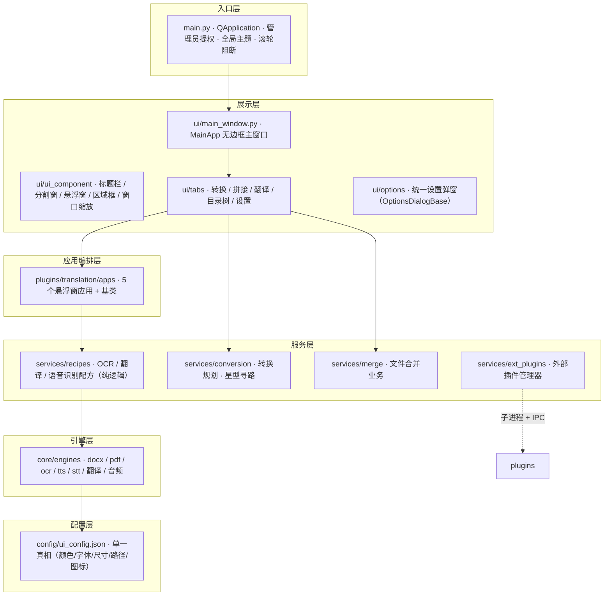

# OCTools

**桌面级多模态翻译与文档工具箱** — 基于 PySide6 的现代化 Windows 应用。

本地优先（Local-First）的 AI 能力 + 模块化插件生态 + 单一真相配置体系。文档互转、多文件拼接、离线中英翻译、屏幕级悬浮窗五件套、语音识别与合成、可热插拔的外部插件系统，全部整合在一个无边框、双主题的清爽界面里。

| | | |
| --- | --- | --- |
| 运行时 | Python 3.12 | PySide6 6.11 |
| 平台 | Windows 10/11 | 原生管理员权限 |
| 离线 AI | PaddleOCR 3.x · llama.cpp · CTranslate2 | SenseVoice · edge-tts |
| 插件 | uv 依赖隔离 · 子进程隔离 · JSON Lines IPC | 3 种加载模式 · 3 种 UI 模式 |

---

## 特性总览

### 文档互转（转换）
- **20+ 格式互通**：Markdown / DOCX / PDF / PPTX / Excel / HTML / 图片等任意互转（`core/formats` 注册表 + 星型寻路自动规划转换链路）
- **单文件 + 文件夹批量**：逐文件转换、队列执行、结果就地落盘
- **排版保真**：标题层级 / 字体 / 段落 / 表格 / 图片等排版参数可配置，支持预设一键导入导出

### 多文件拼接（拼接）
- 文件夹内多文件合并为单个文件
- 三种模式：**自我拼接** / **格式转换拼接** / **图片→文档**

### 离线翻译与屏幕五件套（翻译）
完全本地的中英互译 + 5 个"屏幕级"悬浮窗应用，全部复用同一应用基类：

| 应用 | 说明 |
| --- | --- |
| 屏幕 OCR | 框选区域实时文字识别（PaddleOCR，onnxruntime 后端） |
| 屏幕翻译 | 框选区域 OCR → 离线翻译，悬浮框展示 |
| 屏幕实时翻译 | 区域持续跟踪 + 定时刷新，可拖拽/缩放的 LiveRegionBox |
| 屏幕字幕 | 系统声音回环采集（WASAPI + PyAudioWPatch）→ 实时字幕 |
| 语音翻译 | 说话 → 语音识别 → 离线翻译 → 悬浮字幕 |

- **离线翻译引擎**：Hy-MT2-1.8B（llama.cpp GGUF）与 Opus-MT（CTranslate2），无网络依赖
- **模型预加载**：主程序启动后后台并行预热 OCR + 翻译模型，首次翻译零等待（可配置启动时/进入翻译页时）
- 悬浮窗统一无边框外观：阴阳 logo、可拖动、可缩放、深浅主题跟随

### 目录树 / 取色 / 终端 / 样式实验室
- **目录树**：目录结构可视化
- **取色器**：屏幕取色
- **终端 / 样式实验室**：开发者向扩展示例

---

## 架构设计

### 分层架构



### 设计原则

- **单一真相（Single Source of Truth）**：所有 UI 参数（颜色 / 字体 / 字号 / 尺寸 / 间距 / 图标引用 / 路径）统一声明在 `config/ui_config.json`，由 `CONFIG` 单例加载，`theme.py` 据此动态生成全局 QSS——**改配置即可改主题**，代码零硬编码。
- **能力下沉**：悬浮窗应用 = 编排层（apps）只负责 UI 组装，纯逻辑全部下沉到服务层配方（recipes），引擎层（core/engines）提供原子能力，可独立测试、独立复用。
- **进程即边界**：任何可能引起依赖冲突的能力（第三方 UI 库、不同版本的 numpy 等）都被隔离进独立子进程，主进程永不污染。

---

## 外部插件系统

一个**面向未来的热插拔插件平台**：插件即目录，安装即用，依赖互不干扰。

### 工作流

1. **发现**：扫描 `plugins/<plugin_id>/`，需包含 `main.py` + `requirements.txt`；`manifests/*.json` 决定侧栏注册与排序（自动跳过 `_shared` / `_` 前缀目录）
2. **安装**：`uv --target deps/<plugin_id>` 将依赖安装到插件私有目录，版本冲突物理隔离
3. **运行**：每个插件独立子进程 + 独立 PYTHONPATH，主进程通过 **JSON Lines** IPC 通信
   - 请求：`{"id", "method", "params"}` · 响应：`{"id", "result" | "error"}` · 推送：`{"event", "data"}`
4. **生命周期**：
   - 三种加载模式：`always`（随应用启动）/ `lazy`（首次使用启动）/ `auto_recycle`（启动后 10 分钟空闲自动回收）
   - 心跳保活：ping/pong 5s 超时判定；崩溃自动重启并保留崩溃日志
   - 退出清理：先发 shutdown（优雅退出，5s 超时后强杀），主进程绝不残留子进程

### 三种 UI 集成模式

| 模式 | 场景 | 表现 |
| --- | --- | --- |
| 直接嵌入 | 纯 PySide6、无冲突依赖 | 主进程直接 import 实例化 |
| 隔离渲染 | PySide6 + 额外依赖 | 子进程运行，主进程渲染 JSON 控件树 |
| 独立窗口 | 非 PySide6 UI 库（tk 等） | 子进程自建独立窗口 |

插件内提示统一走 **Toast 协议**：响应中携带 `{"toast": {"message", "kind"}}`，主进程负责弹出——隔离环境下插件永远不需要碰主进程 UI。

---

## 快速开始

### 环境要求

- Windows 10/11（应用会自动请求管理员权限以支持屏幕级能力）
- Python 3.12
- [uv](https://docs.astral.sh/uv/)（外部插件依赖安装器）

### 安装与运行

```powershell
# 1. 创建虚拟环境并安装依赖
python -m venv .venv
.\.venv\Scripts\pip install -r requirements.txt

# 2. 启动（自动提权；如需模型翻译请先在 ui_config.json 配置模型路径）
.\.venv\Scripts\python main.py
```

### 首次使用翻译

在 `config/ui_config.json → paths.models` 配置本地模型路径（Hy-MT2 / Opus-MT / SenseVoice / PaddleOCR），或在翻译设置页中完成配置。默认在应用启动后后台预加载模型。

---

## 配置体系

| 配置 | 作用 |
| --- | --- |
| `config/ui_config.json` | 全局 UI 单一真相：颜色 / 字体 / 尺寸 / 间距 / 图标引用 / 模型与外部工具路径 |
| `config/*.py` | 业务配置模型（排版 / 翻译 / 截图区域 / TTS / STT …），带默认值回退，绝不因配置缺失崩溃 |
| `config/presets.py` | 预设与"上次配置"持久化 |
| `config.json`（根目录） | 外部插件运行时状态（启用 / 加载模式 / 空闲回收超时），缺失自动重建 |
| `config/ui_config.json → themes` | 浅色 / 深色双主题 + 全局缩放 + 运行期参数覆盖 |

---

## 项目结构

```
OCTools/
├── main.py                      # 启动入口（管理员提权 + 全局装配 + 模型预加载）
├── requirements.txt             # 依赖清单（按用途分组、锁定精确版本）
├── config.json                  # 外部插件运行时配置
├── config/                      # 配置层
│   ├── ui_config.json           #   UI 单一真相（颜色/字体/尺寸/路径/图标）
│   ├── ui_config.py             #   CONFIG 单例加载器（缺失回退默认）
│   ├── presets.py + presets/    #   预设 / 上次配置持久化
│   └── *.py                     #   排版/翻译/截图/TTS/STT 配置模型
├── core/                        # 引擎层
│   ├── engines/                 #   原子能力：docx/pdf/ocr/tts/stt/翻译/音频/媒体
│   ├── formats/                 #   格式元数据注册表 + 查询 API
│   └── utils/                   #   通用工具 + 异常体系
├── services/                    # 服务层
│   ├── conversion/              #   格式转换业务（直达表/注册表/星型寻路）
│   ├── merge/                   #   多文件合并业务
│   ├── recipes/                 #   悬浮窗应用配方（OCR/翻译/语音识别）
│   └── ext_plugins/             #   外部插件系统（发现/安装/进程/IPC/生命周期）
├── plugins/                     # 插件层（内置 + 外部）
│   ├── manifests/               #   插件清单（侧栏注册与排序）
│   ├── _shared/                 #   共享设置页（自动跳过扫描）
│   ├── translation/             #   翻译页 + 5 个悬浮窗应用 + 模型预加载
│   ├── conversion/ merge/ tree/ color_pick/ terminal/ style_lab/
│   └── demo_*/                  #   外部插件示例（含 numpy 版本冲突演示）
├── ui/                          # 展示层
│   ├── main_window.py           #   主窗口装配
│   ├── theme.py                 #   全局 QSS 生成（单一真相消费端）
│   ├── icon_res.py              #   SVG 图标着色工具
│   ├── toast.py                 #   轻提示
│   ├── ui_component/            #   无边框标题栏/分割窗/悬浮窗/区域框/窗口缩放器
│   ├── tabs/                    #   各选项卡 + tab_component 通用卡片
│   ├── options/                 #   统一设置弹窗基类（OptionsDialogBase）
│   └── widgets/                 #   格式选择器/滚轮过滤器
├── resources/icons/             # SVG 图标库（页面引用单一来源副本）
├── deps/                        # 外部插件依赖隔离目录（uv --target）
├── logs/                        # 运行日志 / 插件崩溃日志 / 安装日志
├── scripts/                     # 烟测脚本（_smoke_*.py）
└── .tests/                      # 自动化测试 + tools/ 开发诊断工具
```

---

## 测试与开发工具

| 位置 | 内容 |
| --- | --- |
| `scripts/_smoke_*.py` | 无头烟测：外部插件全链路、插件管理器生命周期、9 个设置弹窗统一性 |
| `.tests/test_*.py` | 单元/行为测试：模型路径迁移、悬浮窗缩放、标题栏拖拽、窗口控制 |
| `.tests/tools/` | 开发诊断：`dead_config_keys`（配置死键）、`verify_theme_switch`（主题切换验证）、`render_ui_preview`（UI 预览渲染）、`probe_*`（渲染探针）等 |

运行示例：

```powershell
.\.venv\Scripts\python scripts\_smoke_ext_plugins.py
.\.venv\Scripts\python .tests\test_model_path_migration.py
```

---

## 路线图（面向未来）

- **一键分发**：内嵌 Python 运行时 + uv.exe 打包，用户零环境配置即可安装运行
- **插件 SDK 化**：模板脚手架（`uv init` 式一键生成插件）、插件清单签名、目录化分发
- **AI 能力扩展**：更大规模离线翻译模型、流式语音识别、语音克隆、屏幕智能理解
- **格式生态**：更多文档格式支持、批量流水线（转换 → 翻译 → 拼接）可视化编排
- **跨平台**：Qt 层已跨平台，逐步适配 macOS / Linux（系统级能力按平台降级）

---

## 许可证

本项目为私有项目，许可证待定。如需开源，建议选用 MIT 或 Apache-2.0。
